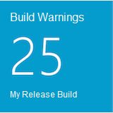

The **Build Warnings** widgets shows the number of build warnings produced for a specific build. This includes Code Analysis warnings as well as compile-time warnings.
### Last builds warnings ###
The **Build Warnings** widget shows the number of warnings produced by the latest build for a specific build definiton.

### Build warnings trend ###
The **Build warnings trend** widget shows the number of build warnings for all historical build for a specific build definition.

